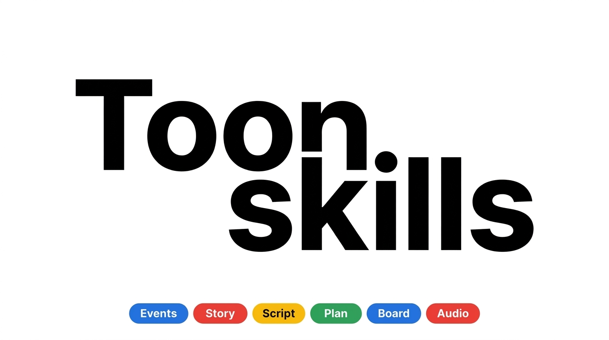

# Toonskills (toonskills.sh)



**Production-grade workflow skills for AI video and novel-to-video production agents.**. Inspired by [Toonflow](https://github.com/HBAI-Ltd/Toonflow-app/tree/master)

Toonskills encapsulates the structured workflows, creative rules, and quality gates that professional directors, screenwriters, storyboard artists, and sound designers use to adapt stories into video formats. These skills are packaged so AI agents can execute them consistently, step-by-step, entirely using file-based interactions.

```
   NOVEL INPUT        STRUCTURE        SCREENPLAY        VISUAL TABLE       PANEL PROMPTS        AUDIO MASTER
 ┌─────────────┐     ┌─────────┐      ┌──────────┐      ┌─────────────┐    ┌──────────────┐     ┌──────────────┐
 │    Event    │ ──▶ │  Story  │ ───▶ │  Screen  │ ───▶ │ Storyboard  │ ───▶│  Storyboard  │ ───▶ │ Sonic Design │
 │  Extraction │     │Skeleton │      │  Writer  │      │    Table    │    │    Panels    │     │   & Mix      │
 └─────────────┘     └─────────┘      └──────────┘      └─────────────┘    └──────────────┘     └──────────────┘
  event-analysis   story-skeleton    write-script     storyboard-table   storyboard-panel     sound-design
```

---

## Architecture: Agnostic File I/O & Presets

Toonskills operates entirely on **Agnostic File I/O** (Markdown & JSON inputs/outputs) to ensure maximum compatibility and zero vendor lock-in. Legacy APIs (like `get_flowData` or custom databases) have been fully purged. Agents read markdown states, write markdown results, and call native tools (like `generate_image`) directly within the workspace.

Additionally, the repository utilizes:
- **Attention Routing**: Filters instructions at the entry points so AI agents only look at permitted layout blocks and tags, eliminating cross-hallucination.
- **Unified Presets**: Style-specific and genre-specific prompt files wrapped in semantic XML tags to avoid redundant context-reading overhead.

---

## Directory Structure

```
toonskills/
├── skills/                     # 9 Core execution skills (distributable)
│   ├── event-analysis/         # Raw novel chapter parsing to events
│   ├── story-skeleton/         # Plot sequencing and structure planning
│   ├── adaptation-strategy/    # Audio-visual direction & tone definition
│   ├── write-script/           # Standard 3-column script writing
│   ├── extract-assets/         # Scene/Character/Prop library management
│   ├── director-plan/          # Technical planning, grouping, and duration rules
│   ├── storyboard-table/       # Shot-by-shot detailed direction
│   ├── storyboard-panel/       # Visual description and prompt construction
│   └── sound-design/           # Multi-layered audio mixing & TTS design
├── presets/                    # XML-wrapped style and genre guides
│   ├── art/                    # 11 Art presets (e.g. 2D Anime, Guofeng Cyber)
│   └── story/                  # 12 Genre presets (e.g. Xianxia, Sci-fi Apocalypse)
└── README.md
```

---

## Installation & Setup

Toonskills can be installed and discovered as a native skill repository across multiple agent platforms.

### Bunx / Npx (Global Installer)

You can run and add these skills via `bunx` or `npx` to initialize them in your workspace:

```bash
bunx skills add https://github.com/minh-vt/toonskills.git
```

### Manual installation

Copy the markdown files under `skills/` to your `.agent/skills/` or reference the directory directly to make the workspace AI aware of the video production constraints.

---

## Core Skills Reference

| Skill | Description | Workspace Input/Output |
|---|---|---|
| [event-analysis](skills/event-analysis/SKILL.md) | Parse novel text into atomic events with emotional tags | Raw Novel Chapter Text $\rightarrow$ Single-line Structured Event |
| [story-skeleton](skills/story-skeleton/SKILL.md) | Formulate dramatic arcs, tension paths, and plot steps | Events List $\rightarrow$ Structured Story Arc Markdown |
| [adaptation-strategy](skills/adaptation-strategy/SKILL.md) | Translate prose style into screen directives and art style bindings | Story Skeleton $\rightarrow$ Adaptation Strategy Config |
| [write-script](skills/write-script/SKILL.md) | Write multi-column screenplay containing visual actions and dialogues | Adaptation Strategy $\rightarrow$ 3-Column Screenplay |
| [extract-assets](skills/extract-assets/SKILL.md) | Identify and bind character ids, locations, and props to prevent drift | Screenplay $\rightarrow$ Project Asset Database |
| [director-plan](skills/director-plan/SKILL.md) | Chunk script scenes, define timing, and map out visual contracts | Screenplay + Assets $\rightarrow$ Director's Plan Markdown |
| [storyboard-table](skills/storyboard-table/SKILL.md) | Construct detailed frame sequences: shot type, camera, audio, visual description | Director's Plan $\rightarrow$ Storyboard Grid |
| [storyboard-panel](skills/storyboard-panel/SKILL.md) | Formulate final prompts using reference-image tags (e.g., `@ImageN`) | Storyboard Grid $\rightarrow$ Storyboard Panel JSON |
| [sound-design](skills/sound-design/SKILL.md) | Generate TTS, ambient loop tracks, foley placements, and ducking mixes | Sonic Direction $\rightarrow$ Mixed Audio Master Instruction |

---

## License

This repository is distributed under the MIT License.
